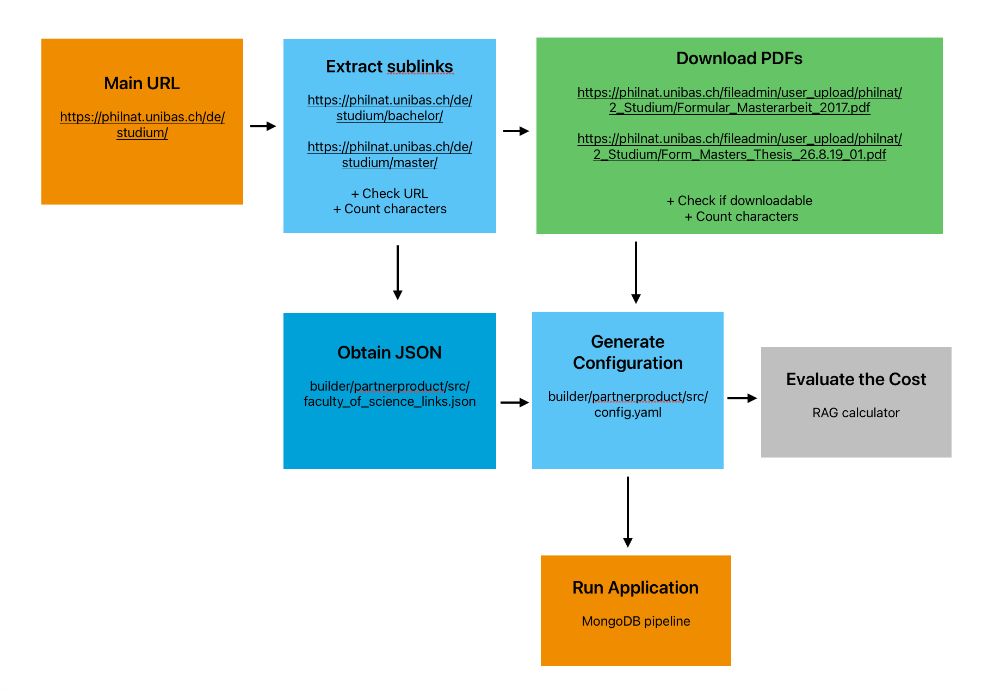

in folders `builder/partnerproduct/src` and `builder/partnerproduct/ui` additional code in Python can be found. To make it work


```
python -m venv myenv
```

```
source myenv/bin/activate
```


```
pip install -r requirements.txt
```

to run Jupyter Lab 

```
ipython kernel install --user --name=myenv
```

```
jupyter lab
```

choose kernel with name `myenv`


----

in `builder/partnerproduct/src/notebooks` 



After setting up the system, we need to do two things:

1. Create a `config.yaml` file.
2. Run a set of three commands in the terminal to ingest documents, run the backend, and run the frontend.

I decided to add all necessary links and PDF files to the config file automatically.

I divided this problem into several tasks:

- Obtain a JSON file with all the URL links (primarily include the main link and automatically find all sublinks; see `get_json.ipynb`.
- Automatically download all PDF documents on these pages, see `get_json.ipynb`.

Along the way:

   - Set a document limit to control the size of the dataset, see `get_json.ipynb`.
   - Count the number of characters in all URL and PDF documents (to evaluate the number of chunks that will be created later—this depends on the parser, but this is just for approximate evaluation; see `get_json.ipynb`).
  
- Generate the config file using the JSON and the downloaded documents (and check that it works, of course, see `get_config.py`).
- Calculate the cost for this RAG configuration, which consists of the cost of the LLM (which might be expensive) and the cost of creating embeddings (which is relatively cheap), see `RAG_calculator.ipynb`.


## Run Application

1. Go to the `maap-chatbot-builder/builder/partnerproduct` directory.
   
2. Run the following command to ingest the documents:

   ```
   npm run ingest src/config.yaml
   ```

3. Open **MongoDB Compass** and check the embeddings in the **chatter** folder.

4. Start the backend by running the following command:

   ```
   npm run start src/config.yaml
   ```

5. Start the UI: Navigate to the `builder/partnerproduct/ui` folder and run:

   ```
   npm start
   ```

Ask 

```
How many students are at the University of Basel?
```

The expected answer: I don’t know. 


```
What was the percentage of external funding for research in 2016?
```

The expected answer: 62%. 


```
Which two National Centres of Competence in Research (NCCRs) are currently running at the faculty?
```

The expected answer: "Molecular Systems Engineering" and "Quantum Science and Technology."


----
# Example for Gemini and VertexAI

Example for using Gemini LLM and Embeddings with `textembedding-gecko` on VertexAI.

```
const llmApplication = await new RAGApplicationBuilder()
    .setModel(new VertexAI({ modelName: 'gemini-1.5-pro-preview-0409'}))
    .setEmbeddingModel(new GeckoEmbedding())
```

List of Gemini LLM models: https://cloud.google.com/vertex-ai/generative-ai/docs/learn/models.


## VertexAI on Google Cloud Platform

- Playground: https://console.cloud.google.com/vertex-ai/generative/multimodal/

- Gemini Documentation: https://cloud.google.com/vertex-ai/generative-ai/docs/multimodal/overview

- VertexAI Pricing: https://cloud.google.com/vertex-ai/generative-ai/pricing

### Setup VertexAI

#### 1. Setup GCP Project, gcloud CLI and Vertex AI
Instructions: (https://cloud.google.com/vertex-ai/docs/start/cloud-environment)

#### 2. (Optional) [Create a new Service Account](https://console.cloud.google.com/iam-admin/serviceaccounts) with least permissive role. 
_You can use role [Vertex AI User](https://cloud.google.com/vertex-ai/docs/general/access-control#aiplatform.user) `roles/aiplatform.user`._

#### 3. Authentication
 
 Documentation: [VertexAI Authentication](https://cloud.google.com/vertex-ai/docs/authentication)

Option 1) `gcloud CLI` Application Default Login.  **Prefered for local development.**
 
Documentation: https://cloud.google.com/docs/authentication/application-default-credentials#personal

 You should be logged in an account, which have permissions for the project.
  ```
  gcloud auth application-default login
  ```

Option 2) On Google Cloud Platform: using a service account which have permissions to the project and VertexAI

Documentation: https://cloud.google.com/vertex-ai/docs/authentication#on-gcp

Option 3) Environment variable with path to JSON key for Service Account

Documentation: https://cloud.google.com/docs/authentication/application-default-credentials#GAC

- Download the Service Account's key after you have created it in Step 2.

- Setup `GOOGLE_APPLICATION_CREDENTIALS` .env variable with the path to the downloaded JSON credentials:
```
GOOGLE_APPLICATION_CREDENTIALS=/path/to/credentials.json
```

NOTE: Using service account with JSON key can impose security risk if not stored correctly. Please revise [Best Practices](https://cloud.google.com/iam/docs/best-practices-for-managing-service-account-keys).

