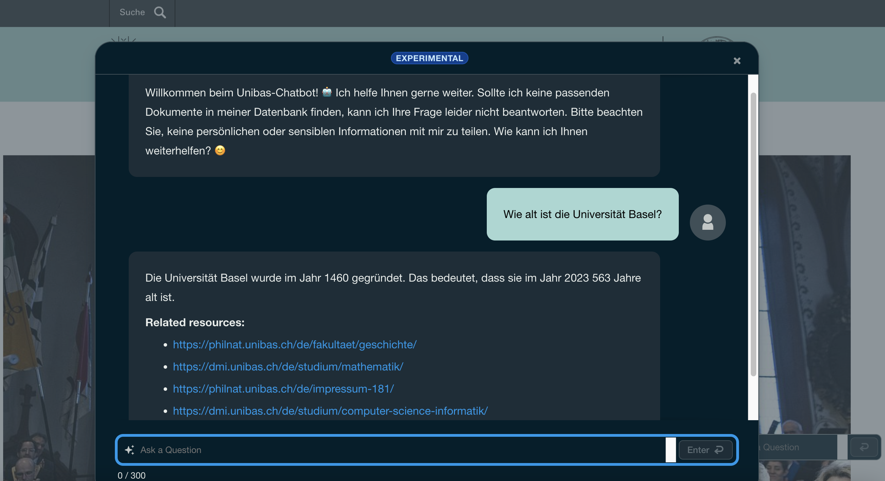

## Modifications

The purpose of these modifications was to adapt the app for document collection and evaluate the performance of the resulting system. All changes can be found in `src/notebooks`.  

- To collect all necessary documents for ingestion into the database, the script `src/notebooks/get_json.ipynb` extracts data from a small subset of links using web scraping. It verifies that the links work, counts characters, selects first-order sublinks, and saves them. The URLs and PDFs used can be found in `src/faculty_of_science_links.json`. For the evaluation of system quality, FAQ sections of websites were excluded from the dataset.  

- The selected configuration file, `config.yaml`, can be created using `src/notebooks/get_config.py`. Then, using the MAAP standard workflow, documents can be ingested with `npm run ingest src/config.yaml`. To start the backend, use `npm run start src/config.yaml`, and to launch the UI, run `npm start`. The application should look like this:  




In the current version PDF files can be find in local folder. 

## Evaluation   

One of the biggest challenges in building a reliable and cost-effective RAG system is the systematic evaluation of answers for a specific dataset. To evaluate the quality of the system, we created two datasets:  
  1) **Real test dataset**: This dataset consists of privately sent documents containing questions and answers, as well as data from FAQ sections. More details can be found in `src/notebooks/tests/get_ground_truth.ipynb`.  
  2) **Fake test dataset**: This dataset contains random records from the database with LLM-generated answers based only on a single record. See the last section in `src/notebooks/tests/get_RAG_answers.ipynb` for more details.    
 
To assess retrieval, semantic similarity, and overall answer quality, four metrics were used: **recall, cosine similarity, Jaccard similarity, and unit tests** (with an LLM as the judge). Results of the evaluation can be found in `src/notebooks/tests/evaluate.ipynb` and `src/notebooks/tests/analyze.ipynb`. 

 To determine the utility-cost tradeoff for the implemented RAG application with the specified configuration, one can use the RAG calculator by running the following command:

  ```bash
  python src/notebooks/RAG_calculator.py
  ```  
  More details can be found in `src/notebooks/RAG_calculator.ipynb`. 

### Evaluation Metrics  

| Metric               | Real Dataset | Fake Dataset |
|----------------------|-------------|-------------|
| Jaccard Similarity  | 0.11        | 0.36        |
| Cosine Similarity   | 0.91        | 0.98        |
| Recall             | 82%         | 70%         |
| Unit Test Passed   | 47%         | 100%        |

The **real dataset** introduces more complexity, leading to lower Jaccard similarity, lower unit test success rates, and artificially high recall. While cosine similarity remains high in both datasets, it may not be sufficient for evaluating true answer quality.  

### Impact of Reranking  

Reranking was applied by filtering vector search results through **post-selection using a specialized LLM** (Cohere was used to select 5 records from 30).  

| Metric               | Real Dataset | Real Dataset (LLM with Reranking) |
|----------------------|-------------|----------------------------------|
| Jaccard Similarity  | 0.11 (max = 0.25) | 0.10 (max = 0.33) |
| Cosine Similarity   | 0.91        | 0.91        |
| Recall             | 82%         | 82%         |
| Unit Test Passed   | 47%         | 59%         |

### Takeaways  

- **Similarity metrics confirm that the system provides answers consistent with expectations.** However, the recall metric should be either replaced with a more representative metric or supplemented with additional human-selected sources.  
- **Unit tests using an LLM as the judge are a highly useful evaluation method** due to their sensitivity to changes in the pipeline.  
- **Reranking positively impacted overall performance**, particularly in terms of the unit test success rate and maximum Jaccard similarity.  

---

To make additional code in `builder/partnerproduct/src` in Python work 

```
python -m venv myenv
```

```
source myenv/bin/activate
```


```
pip install -r requirements.txt
```

to run Jupyter Lab 

```
ipython kernel install --user --name=myenv
```

```
jupyter lab
```

choose kernel with name `myenv`


----
# Example for Gemini and VertexAI

Example for using Gemini LLM and Embeddings with `textembedding-gecko` on VertexAI.

```
const llmApplication = await new RAGApplicationBuilder()
    .setModel(new VertexAI({ modelName: 'gemini-1.5-pro-preview-0409'}))
    .setEmbeddingModel(new GeckoEmbedding())
```

List of Gemini LLM models: https://cloud.google.com/vertex-ai/generative-ai/docs/learn/models.


## VertexAI on Google Cloud Platform

- Playground: https://console.cloud.google.com/vertex-ai/generative/multimodal/

- Gemini Documentation: https://cloud.google.com/vertex-ai/generative-ai/docs/multimodal/overview

- VertexAI Pricing: https://cloud.google.com/vertex-ai/generative-ai/pricing

### Setup VertexAI

#### 1. Setup GCP Project, gcloud CLI and Vertex AI
Instructions: (https://cloud.google.com/vertex-ai/docs/start/cloud-environment)

#### 2. (Optional) [Create a new Service Account](https://console.cloud.google.com/iam-admin/serviceaccounts) with least permissive role. 
_You can use role [Vertex AI User](https://cloud.google.com/vertex-ai/docs/general/access-control#aiplatform.user) `roles/aiplatform.user`._

#### 3. Authentication
 
 Documentation: [VertexAI Authentication](https://cloud.google.com/vertex-ai/docs/authentication)

Option 1) `gcloud CLI` Application Default Login.  **Prefered for local development.**
 
Documentation: https://cloud.google.com/docs/authentication/application-default-credentials#personal

 You should be logged in an account, which have permissions for the project.
  ```
  gcloud auth application-default login
  ```

Option 2) On Google Cloud Platform: using a service account which have permissions to the project and VertexAI

Documentation: https://cloud.google.com/vertex-ai/docs/authentication#on-gcp

Option 3) Environment variable with path to JSON key for Service Account

Documentation: https://cloud.google.com/docs/authentication/application-default-credentials#GAC

- Download the Service Account's key after you have created it in Step 2.

- Setup `GOOGLE_APPLICATION_CREDENTIALS` .env variable with the path to the downloaded JSON credentials:
```
GOOGLE_APPLICATION_CREDENTIALS=/path/to/credentials.json
```

NOTE: Using service account with JSON key can impose security risk if not stored correctly. Please revise [Best Practices](https://cloud.google.com/iam/docs/best-practices-for-managing-service-account-keys).

